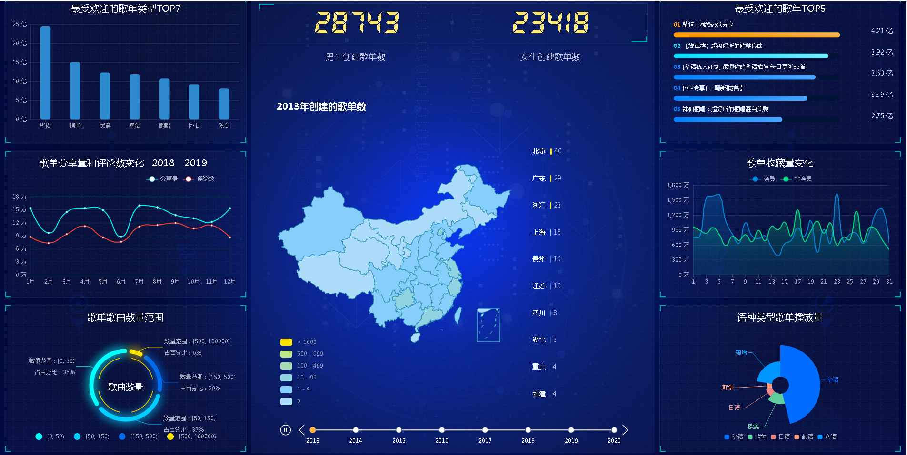
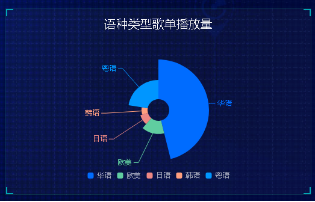

## Python网易云音乐爬虫可视化系统 音乐数据分析

## 要求
源码600一套不议价(论文 开题报告  文献综述 讲解视频 讲解笔记 源码+sql脚本)
白嫖滚蛋！源码收费的！别怨repo主爆粗口只是每天被一群白嫖杂种整神经了
加好友前帮忙start一下，并备注github有偿获取源码
我的QQ号是2877135669
加qq好友说明（被部分 s b 网友整得心力交瘁）：
    1.加好友务必按照格式备注
    2.避免浪费各自的时间，不议价！不议价！不议价！
    3.当“客服”不容易，repo 主是体面人，不爆粗，性格好，文明人。上面的 sb 字眼请谅解
    
## 为啥这么娼？
全网只有我的音乐爬虫每年都会维护防止失效，你要觉得自己能github/gitee搜到免费能用
并且当前不失效的音乐爬虫我叫你一声爹！就这么自信！不行咱们试试！！    

另外实话告诉你网易云音乐现在可多接口全死了，你要觉得你自己挺厉害，请绕行别找我！

## 开发技术

requests pymysql flask框架 pandas numpy

## 功能

最受欢迎的歌单类型Top7、歌单分享量和评论数变化、歌单歌曲数量范围、男生创建歌单数、女生创建歌单数、XXX年创建的歌单数(地图、时间轴)、最受欢迎的歌单Top5、歌单收藏量变化、语种类型歌单播放量	
	
#运行截图
	

#运行视频(B站)
https://www.bilibili.com/video/BV1NT4y177TT?spm_id_from=333.999.0.0

